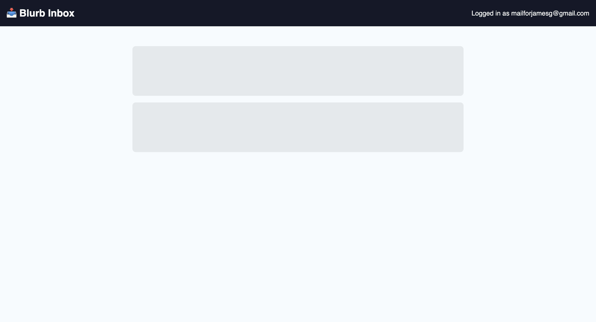

## Day 1
Scaffolding, brainstorming, ideation with ChatGPT 4o

## Day 2
## Day 3

## Day 4

Giving GH repo acces to Claude to pair program for PWA demo on local server. 

I was able to commit to github, import the repo to Claude, and ask if it saw any issues with the work I did, in tandem with what it recommended.

Claude scrubed all files, and identified these improvement areas - which was right on the money:

Recommendations:

1. Create a /public/assets directory with all required icon files
2. Fix the duplicate service worker registrations
3. Separate API handlers into their respective files
4. Add a specific route for manifest.json and service-worker.js in vercel.json
5. Generate proper VAPID keys for push notifications
6. Create a shared module for Supabase client initialization

